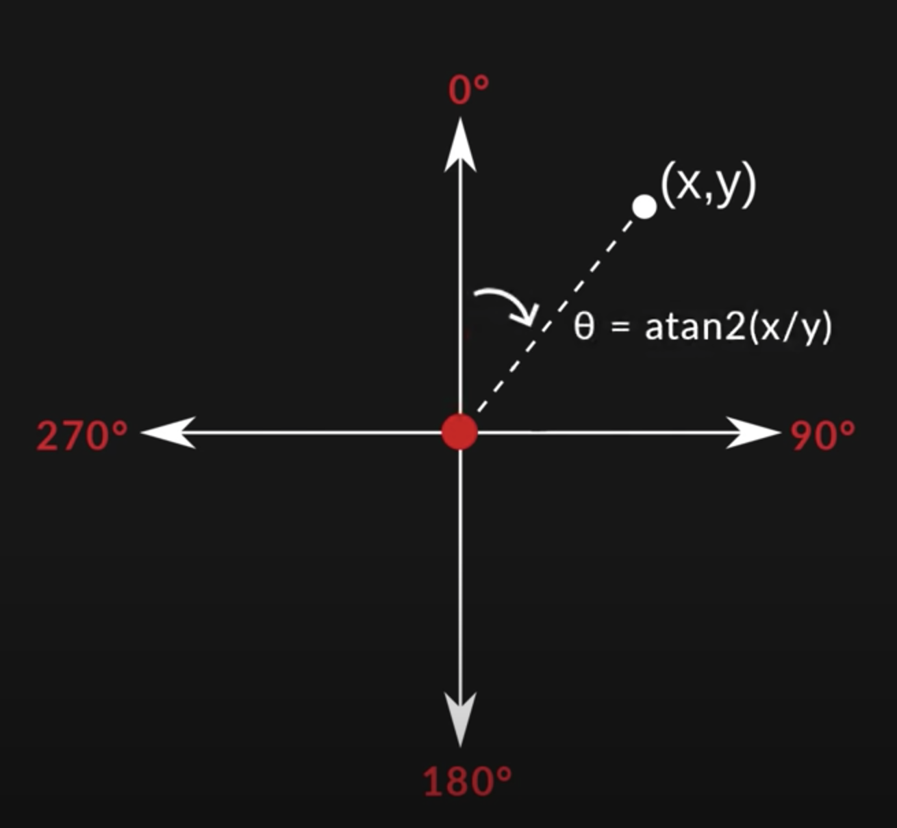

# Third.person.movement.sandbox

## Player controller notes

### CalculateMoveDirection

Calculating the angle between where we are facing and the indicated input direction

Brackey's [video](https://youtu.be/4HpC--2iowE?t=703) the explains this. (ignore mention of using direction.z vs .y, he is using a vector3)